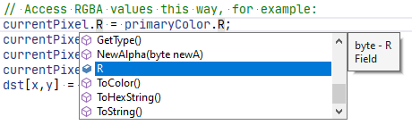

# AutoComplete Box

The AutoComplete Box displays Object Types, static & instance members, constructors, keywords, and snippets.

## Filtering

### String Filtering

As you continue to type while the AutoComplete Box is open, the list of items will filter to only match the characters you've typed.

!!! Tip
    You can also filter using Initials. ex: Typing "isc" will match **I**nt**S**lider**C**ontrol

### Object Filtering

If you only want to show a specific object type, you can use one of these hotkeys to invoke filtering:

++alt+l++ --- Only show Local Variables & Parameters

++alt+o++ --- Only show Constants

++alt+p++ --- Only show Properties

++alt+f++ --- Only show Fields

++alt+m++ --- Only show Methods

++alt+c++ --- Only show Classes

++alt+s++ --- Only show Structs

++alt+e++ --- Only show Enums

++alt+k++ --- Only show Keywords

++alt+t++ --- Only show Snippets

++alt+i++ --- Only show Interfaces

!!! Info
    Only one Object Filter can be used at a time.
