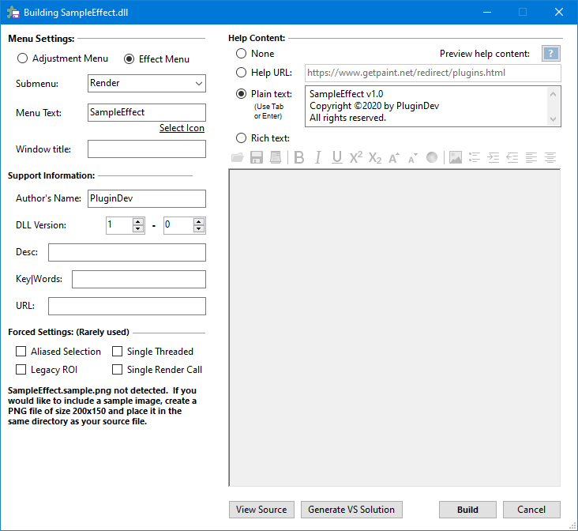

# DLL Builder

TODO

## Fields

TODO

### Menu Settings

TODO

Name, submenu, author, ect.

### Support Settings

TODO

### Forced Settings

TODO

### Help Content

TODO

Help content can take 4 forms:

- None. If no help text is entered, no ? button will be added to your effect.

- Plain text (including tabs and returns). This will be displayed in a modal message box.

- URL. If your help text is a URL, it will be opened in a non-modal browser window.

- Rich Formatted Text. This will be displayed in a modal pop up form with a rich text format control. All RTF features are supported including pictures. All URLs included are automatically clickable and open in a new browser window.

## Supplemental Files

TODO

- EffectNames.png --- `16x16` Effect Icon
- EffectNames.example.png --- `200x150` image to display in the Plugin Browser
- EffectNames.rtf --- Help content in the Rich Text File format