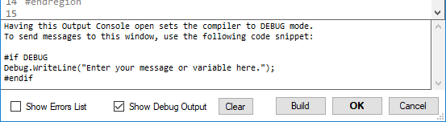

# Debug Output



The Debug Output pane displays debug messages from your code. This can be useful for evaluating variable values, among other things.

!!! Example
    ```csharp
    Debug.WriteLine("My Debug Message!");
    ```

!!! Example
    ``` csharp
    Debug.WriteLine(myVariable);
    ```

## Debug Mode

When the Debug Output pane is opened, the compiler is automatically set to `Debug` mode. (this doesn't affect 'Build DLL' or 'Preview Effect'; they always use `Release` mode)

Likewise, when the Debug Output pane is closed, the compiler is automatically set to `Release` mode.

!!! Example
    ```csharp
    #if DEBUG
        // This code only runs when compiling in Debug mode
        DoSomething();
    #endif
    ```
