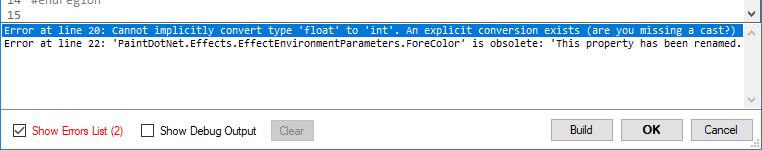
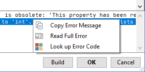

# Error List

This pane will display a list of any errors in your C# code.

Click on the individual errors to jump to the portion of the code that caused the error.

Due to errors in your code (like mismatched `{` or `}`) the error may be flagged outside of your code. Please check the structure of your script to correct those types of errors.

!!! Note
    Errors are also indicated in the editor with red squiggle underlines.

## Context Menu

### Copy Error Message

Copies the error message (excluding the error number and the line number) to the clipboard.

### Read Full Error

Open a dialog box containing the full error for easier reading.

### Lookup Error Code

Opens the [online documentation](https://docs.microsoft.com/dotnet/csharp/language-reference/compiler-messages/) for the specific error code.
