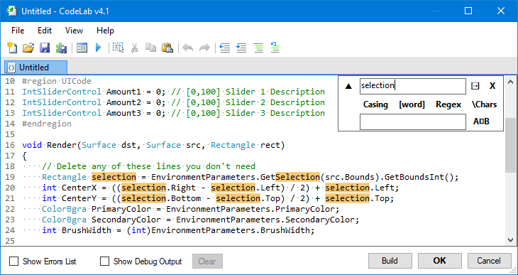

# Find & Replace

The Find & Replace panel allow you to search the code document, and highlight all instances that match the search string.

## Find Options

### Match Casing

To qualify as a match, every character of the string must have the same casing of search string.

!!! Example
    `casing` would not match `cAsInG`.

    `CaSiNg` would match `CaSiNg`.

### Whole Word

TODO

### Regular Expressions

TODO

### Interpret Escape Characters

TODO

## Replace

TODO

### Replace All

TODO
