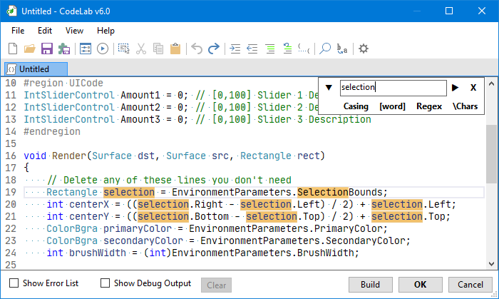

# Find & Replace

The Find & Replace panel allow you to search the code document, and highlight all instances that match the search string.

## Find Options

### Match Casing

To qualify as a match, every character of the string must have the same casing of search string.

!!! Example
    `myWord` would match `myWord`, but not `MyWord`.

### Whole Word

!!! Example
    `Selection` would match `selection`, but not `GetSelection`.

### Regular Expressions

!!! Example
    `Amount\d` would match `Amount1` and `Amount2`.

### Interpret Escape Characters

!!! Example
    `\r\n` would allow your search to span to the next line.

## Replace

This is the string you wish to use as a replacement of your search query.

### Replace All

Pressing this button will replace all instances of your search query with your replacement string.
