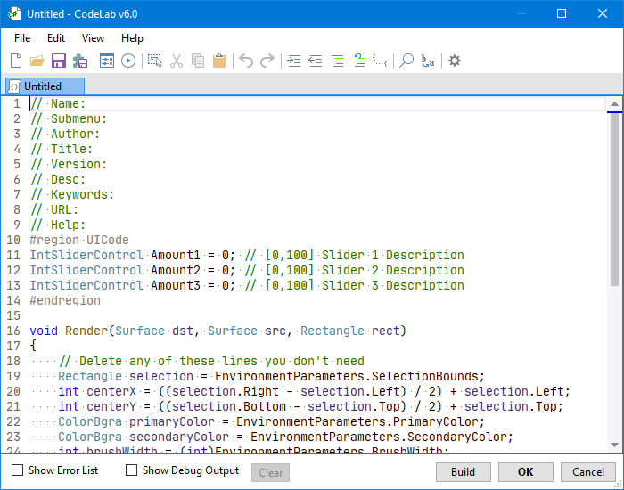

# Main Window

## Menus

See the [Menus](menus.md) page for details.

## Toolbar

See the [Toolbar](toolbar.md) page for details.

## Tab Bar

See the [Tab Bar](tab-bar.md) page for details.

## Editor

See the [Editor](editor.md) page for details.

## Error List

See the [Error List](error-list.md) page for details.

## Debug Output

See the [Debug Output](debug-output.md) page for details.

## Build Button

The build button can be used to compile your current script and run the effect on your current selection.

When you pause typing in the code editor for a few seconds, CodeLab will automatically run this Build process for you.

If build errors occur, they will be listed in the [Error List](error-list.md) pane.

## OK Button

When you are happy with your effect, press the OK button to finalize the effect to your current selection.

## Cancel Button

If you do not like your effect, press the Cancel button to close the CodeLab editor window WITHOUT applying any changes to your original image.
