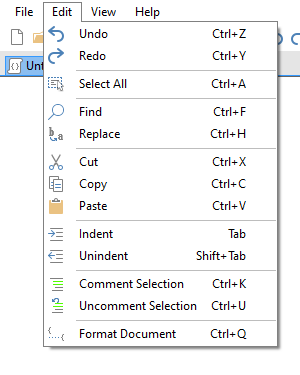

# Menus

## File

### New (Ctrl + N)

Opens the [New Document](new-doc.md) dialog, which allows for to configurable templates.

### Open... (Ctrl + O)

Display a dialog to choose a `.cs` file to load into CodeLab.

### Open Recent

This will open a submenu containing the eight most recently opened .cs files.

### Save (Ctrl + S)

This will save changes to an opened `.cs` file.

### Save As... (Ctrl + Shift + S)

This will open the standard Windows Save As... dialog box. When you pick a name and click OK, CodeLab will save your current script to that file. It is important that your filename uses alphanumeric characters only (no spaces or other special symbols) as this name will be used for your effect's internal namespace when building a DLL of your effect.

Saving a file updates the filename shown in the CodeLab title bar. This is important because when you build a DLL file, this is the name that the DLL file will have.

### Build DLL... (Ctrl + B)

Use this option when you are happy with your effect and want to make it a permanent part of your Paint.NET (or you want to share your effect with your friends). Be sure to save your script file (++ctrl+s++) before saving as a DLL.

See this page for more details on creating DLL files for use with Paint.NET.

### User Interface Designer (Ctrl + I)

Use this option before you start editing your Render function to design the user interface controls your effect will have.

See this page for more details on using CodeLab's UI designer.

### Preview Effect (Ctrl + P)

 Allows you to run your Effect with a fully functional UI, directly from within CodeLab, without building a dll file and installing it.

### Exit

This will close the editor without building a DLL or even applying your effect to the current selection.

## Edit

### Undo (Ctrl + Z)

Steps backwards in the edit history of the document.

### Redo (Ctrl + Y)

Steps forwards in the edit history of the document.

### Select All (Ctrl + A)

This command selects your entire script within the code window. From there, you can...

### Find (Ctrl + F)

Open the Find & Replace panel.

### Replace (Ctrl + H)

Open the Find & Replace panel in expanded form.

___

### Cut (Ctrl + X)

This command deletes the currently selected code in the editor window and places a copy of the deleted code onto the clipboard.

### Copy (Ctrl + C)

This command places a copy of the currently selected code in the editor window onto the clipboard. The currently selected code is NOT deleted.

### Paste (Ctrl + V)

This command replaces the current selection with the code from the clipboard.

### Indent (Tab)

If you have lines of code selected in the editor window, pressing the tab key will indent those lines by four spaces.

If only a partial line is selected, after pressing the tab key, the entire line will become selected.

### Unindent (Shift + Tab)

If you have lines of code selected in the editor window, pressing the shift-tab key will unindent those lines by four spaces.

If only a partial line is selected, after pressing the shift-tab key, the entire line will become selected.

### Comment Selection (Ctrl + K)

Prepends the selected lines with `//` to transform it into comment. Useful when wanting to temporarily disable part of your code.

### Uncomment Selection (Ctrl + U)

Removes any prepended `//` from the selected lines.

### Format Document (Ctrl + Q)

Automatically indents code, and trims whitespace from line ends.

## View

### Errors List (Ctrl + E)

This will toggle the visibility of the errors list.

### Debug Output (Ctrl + Alt + O)

This toggles the visibility of the debug output.

!!! Note
    Having the debug output visible will also put the compiler into Debug mode.

### Transparency

By default, the CodeLab window is not transparent at all. If you would like to be able to see through the code window to observe the effect your script is having on the current selection, use this option to modify CodeLab's transparency level. You may select 50% (nearly transparent), 25%, 10% (barely transparent), and 0% (not transparent).

## Help

### Help Topics... (F1)

Opens the online CodeLab Help page.

### Changes on this version...

Opens the online changelog.

### Discuss Plugin Development...

Open the online forum for Paint.NET plugin development.

### CodeLab Settings...

Opens the CodeLab [Settings](settings.md) dialog.

### About...

Shows the About box which includes the version number and copyright message for CodeLab.
