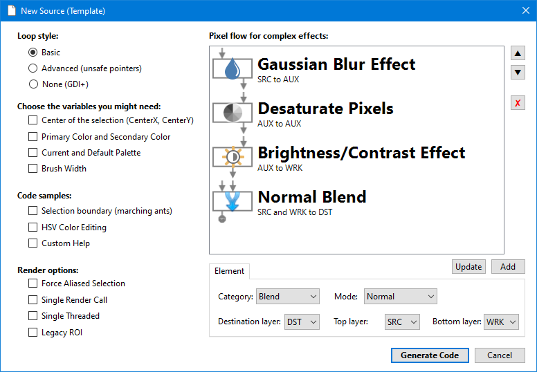

# New Document

This allows you to create a new code document by configuring templates.

TODO

## Loop Style

TODO

- Basic --- 
- Advanced (unsafe pointers) --- 
- None (GDI+) --- 

## Variables

TODO

## Pixel Flow for complex effects

TODO

## Additional Settings

TODO
