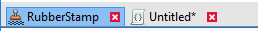

# Tab Bar

The Tab Bar allows CodeLab to quickly switch between multiple open scripts.

## Tab Overview

Each tab will display an icon and a title.

If an icon (PNG format) exists for the `.cs` file, it will be displayed. Otherwise, a generic icon is displayed.

If the file has unsaved changes, an asterisk (`*`) is display to the right of the title.

## Closing Tabs

Tabs may be closed in any of these three ways:

- `Ctrl` + `W`
- Mouse middle click
- Click red X
