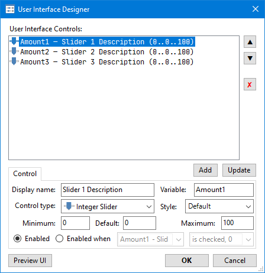

# User Interface Designer



When CodeLab starts, it loads a default script that contains a Render function and a UICode block that defines the type of interface your effect will have. The default UICode block looks like this:

```csharp
#region UICode
IntSliderControl Amount1 = 0; // [0,100] Slider 1 Description
IntSliderControl Amount2 = 0; // [0,100] Slider 2 Description
IntSliderControl Amount3 = 0; // [0,100] Slider 3 Description
#endregion
```

The UICode block starts with the `#region UICode` line, ends with the `#endregion` line, and contains one line for each control you wish to include in your effect UI. Each of those interior lines defines a variable for use in your render loop and describes to CodeLab how you want the control to look. You may include as many or as few lines as you wish. The default script contains definitions for 3 integer sliders that have a default value of 0 and a range of 0 to 100.

## Preview

This displays a preview of the of built dialog window.
